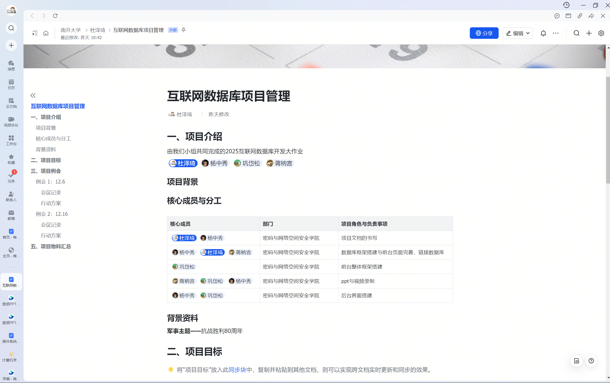
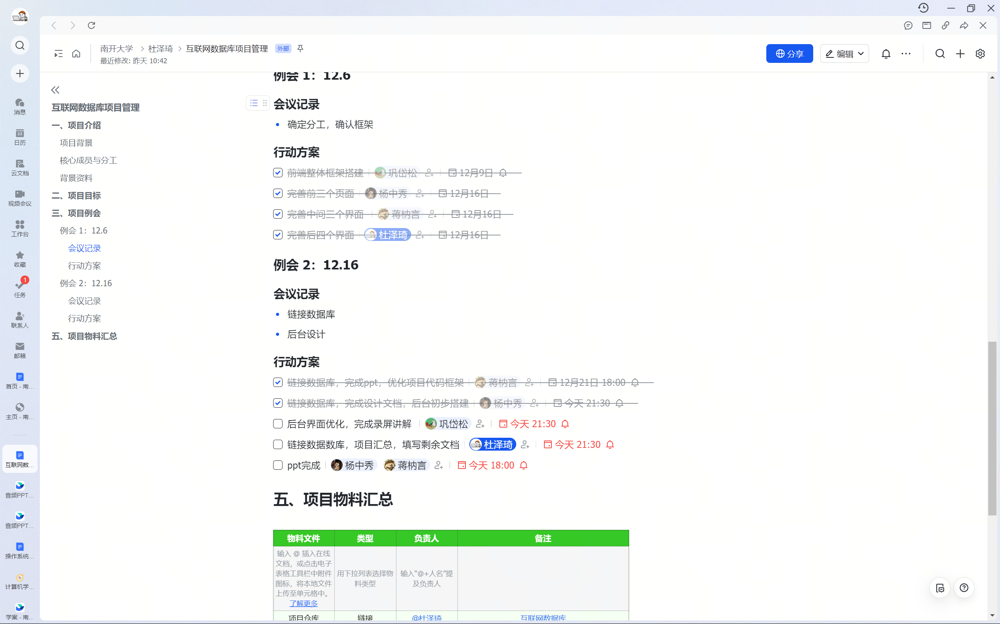
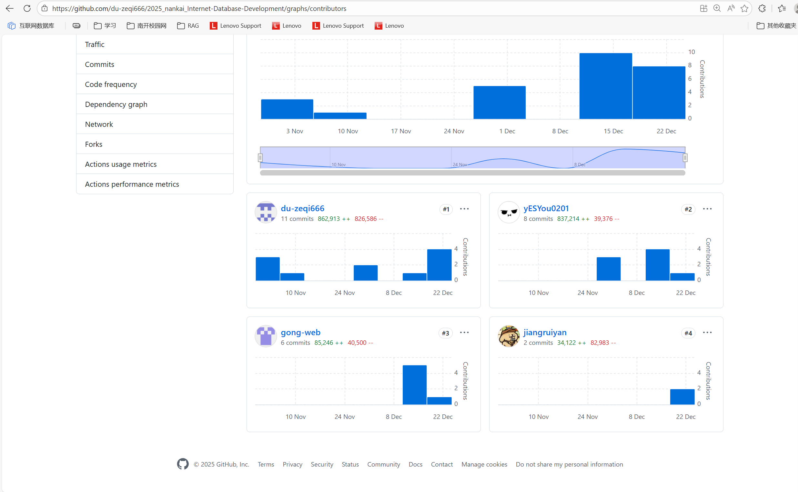

# <center>实现过程(界面截图置于用户手册)

## 任务分工过程(例如Tower截图)，Git提交记录:

[飞书分工链接](https://nankai.feishu.cn/wiki/DDDYwmQFWiBP4jks6K5cl75UnCh?from=from_copylink)





[GitHub提交记录](https://github.com/du-zeqi666/2025_nankai_Internet-Database-Development/commits/main/)


[代码](https://github.com/du-zeqi666/2025_nankai_Internet-Database-Development/graphs/contributors)



## 主要代码及目录展示：

本项目基于 Yii2 Advanced 框架开发，采用前后端分离（逻辑上分离，物理上在同一仓库）的架构设计。主要目录结构如下：

- **backend/**: 后台管理子系统，主要用于管理员对网站内容（文章、英雄、战役等）进行增删改查管理。
    - `config/`: 后台特有的配置文件。
    - `controllers/`: 控制器层，包含 `ArticleController`, `HeroController` 等管理逻辑。
    - `models/`: 后台特有的模型类，主要用于搜索和表单验证（如 `ArticleSearch`）。
    - `views/`: 视图层，存放后台管理的页面模板。
    - `web/`: 后台入口目录，包含 `index.php` 入口文件和静态资源。

- **frontend/**: 前台展示子系统，面向普通用户，提供浏览、搜索、交互等功能。
    - `config/`: 前台特有的配置文件。
    - `controllers/`: 前台控制器，处理用户请求。
    - `models/`: 前台特有的模型类。
    - `views/`: 前台页面视图。
    - `web/`: 前台入口目录。

- **common/**: 公共模块，存放前后台共用的代码和配置。
    - `config/`: 全局公共配置（如数据库连接）。
    - `models/`: 公共数据模型（如 `User`, `Article`, `Hero` 等核心实体类）。
    - `widgets/`: 自定义公共小部件。

- **console/**: 控制台应用，用于执行命令行任务。
    - `migrations/`: 数据库迁移文件，用于版本化管理数据库结构。

- **vendor/**: 第三方依赖包目录，由 Composer 自动管理。

- **environments/**: 环境配置目录，包含开发环境（dev）和生产环境（prod）的初始化配置。

- **data/**: 数据目录，包含数据库初始化脚本 `install.sql`。

## 主要界面代码结构及功能讲解

### 1. 前台：首页 (Site Interface)

**代码结构：**

- **Controller**: `frontend/controllers/SiteController.php`
- **View**: `frontend/views/site/index.php`, `frontend/views/site/login.php`, `frontend/views/site/signup.php`
- **Models**: `common/models/LoginForm.php`, `frontend/models/SignupForm.php`, `frontend/models/ContactForm.php`

**功能与实现讲解：**
首页是用户访问网站的入口，主要由 `SiteController` 控制器负责处理。该控制器不仅负责渲染网站的主页（`actionIndex`），还集成了用户认证（登录、注册、注销）以及静态页面（如关于我们、联系我们）的逻辑。

在 `actionIndex` 中，控制器通常会渲染 `index.php` 视图，该视图展示了网站的核心价值主张、轮播图以及导航入口。作为“数据四骑士”项目的门面，首页的设计注重视觉冲击力和导航的便捷性，引导用户快速进入“英雄人物”、“重大战役”等核心板块。

用户认证方面，`actionLogin` 和 `actionSignup` 分别处理用户的登录和注册请求。登录功能依赖于 `common\models\LoginForm` 模型，该模型负责验证用户的用户名和密码，并处理“记住我”等功能。注册功能则通过 `frontend\models\SignupForm` 模型实现，负责收集用户信息（用户名、邮箱、密码），并进行严格的后端验证（如邮箱唯一性、密码强度等），验证通过后将新用户保存到 `user` 数据库表中。

**数据库关系：**
- **User 表**：`SiteController` 的认证功能直接与数据库中的 `user` 表交互。`user` 表存储了用户的核心身份信息，包括加密后的密码哈希（password_hash）、认证密钥（auth_key）以及邮箱等。
- **Developer 表**：在部分实现中，首页可能还会展示开发团队信息，这会涉及到 `developer` 表的数据读取。

**关键代码片段 (`SiteController.php`)：**
```php
public function actionLogin()
{
    if (!Yii::$app->user->isGuest) {
        return $this->goHome();
    }

    $model = new LoginForm();
    if ($model->load(Yii::$app->request->post()) && $model->login()) {
        return $this->goBack();
    }

    $model->password = '';
    return $this->render('login', [
        'model' => $model,
    ]);
}
```

### 2. 前台：用户登录与注册界面 (Login & Signup Interface)

**代码结构：**
- **Controller**: `frontend/controllers/SiteController.php`
- **View**: `frontend/views/site/login.php`, `frontend/views/site/signup.php`
- **Model**: `common/models/LoginForm.php`, `frontend/models/SignupForm.php`

**功能与实现讲解：**
用户认证是任何现代 Web 应用的基础。本项目提供了完整的注册和登录流程。

- **注册 (Signup)**: `SignupForm` 模型负责接收用户输入的用户名、邮箱和密码。它内置了严格的验证规则，例如检查用户名是否已存在、邮箱格式是否正确以及密码长度是否符合安全要求。验证通过后，模型会创建一个新的 `User` 对象，并调用 `setPassword` 方法对密码进行哈希加密，最后保存到数据库。
- **登录 (Login)**: `LoginForm` 模型负责验证用户的凭据。它通过 `User::findByUsername` 查找用户，并使用 `validatePassword` 方法比对输入的密码与数据库中的哈希值。如果验证成功，`Yii::$app->user->login` 方法将被调用，建立用户会话（Session）。

视图层 `login.php` 和 `signup.php` 使用了 Yii2 的 `ActiveForm` 小部件，自动生成带有客户端验证功能的 HTML 表单，提供了良好的用户体验。

**数据库关系：**
- **User 表**：存储用户的核心认证信息。
    - `username`: 用户名
    - `auth_key`: 认证密钥（用于“记住我”功能）
    - `password_hash`: 加密后的密码
    - `email`: 邮箱

**关键代码片段 (`SignupForm.php` 逻辑)：**
```php
public function signup()
{
    if (!$this->validate()) {
        return null;
    }
    
    $user = new User();
    $user->username = $this->username;
    $user->email = $this->email;
    $user->setPassword($this->password);
    $user->generateAuthKey();
    
    return $user->save() ? $user : null;
}
```

### 3. 前台：英雄人物界面 (Hero Interface)

**代码结构：**
- **Controller**: `frontend/controllers/HeroesController.php`
- **View**: `frontend/views/heroes/index.php` (列表页), `frontend/views/heroes/view.php` (详情页)
- **Model**: `common/models/Hero.php`

**功能与实现讲解：**
英雄人物界面是展示历史英雄事迹的核心模块。`HeroesController` 提供了两个主要的动作：`actionIndex` 和 `actionView`。

`actionIndex` 负责获取所有英雄的数据列表。它通过 `Hero::find()->all()` 查询数据库，将结果传递给 `index.php` 视图。视图层使用卡片式布局（Card Layout）展示每位英雄的照片、姓名和生卒年份，用户点击卡片即可跳转到详情页。

`actionView($id)` 负责展示特定英雄的详细信息。它接收一个 `id` 参数，通过 `Hero::findOne($id)` 在数据库中查找对应的记录。如果找不到记录，系统会抛出 `NotFoundHttpException` 异常，提示用户该英雄不存在。详情页 `view.php` 会展示英雄的详细生平、籍贯、事迹简介以及相关的历史照片。此外，详情页通常还会通过关联查询，展示该英雄参与的战役或相关的时间轴事件，提供更立体的历史视角。

**数据库关系：**
- **Hero 表**：核心数据存储在 `hero` 表中，字段包括 `id`, `name`, `birth_year`, `death_year`, `birth_place`, `introduction`, `photo` 等。
- **Timeline 表**：`Hero` 模型中定义了 `getTimelines()` 关联方法（HasMany），通过 `related_hero_id` 外键关联到 `timeline` 表。这使得在英雄详情页可以方便地列出该英雄生平的重要时间节点。

**关键代码片段 (`HeroesController.php`)：**
```php
public function actionView($id)
{
    $hero = Hero::findOne($id);
    if (!$hero) {
        throw new NotFoundHttpException('该英雄不存在或已下架');
    }
    
    // 渲染视图文件，并传递 hero 对象
    return $this->render('view', [
        'hero' => $hero,
    ]);
}
```

### 4. 前台：重大战役界面 (Battle Interface)

**代码结构：**
- **Controller**: `frontend/controllers/BattlesController.php`
- **View**: `frontend/views/battles/index.php`, `frontend/views/battles/view.php`
- **Model**: `common/models/Battle.php`

**功能与实现讲解：**
重大战役界面旨在重现历史上的关键战役。与英雄界面类似，`BattlesController` 实现了列表展示（`index`）和详情展示（`view`）的功能。

在 `index` 页面，用户可以浏览战役列表，通常按时间顺序或重要性排列。每个战役条目展示了战役名称、发生时间、地点以及简短的描述。

在 `view` 详情页面，系统会展示战役的详尽信息，包括起止时间、具体地点、详细经过（description）、战役结果（result）以及历史意义（significance）。为了增强可视化效果，详情页通常会包含战役地图（map_image）和相关历史图片。代码逻辑上，`Battle` 模型对数据进行了封装，确保日期的格式化显示和文本内容的安全性。

**数据库关系：**
- **Battle 表**：数据存储在 `battle` 表中。关键字段有 `name`, `start_date`, `end_date`, `location`, `description`, `result`, `significance`。
- **关联关系**：虽然在基础代码中未完全展示，但逻辑上 `Battle` 与 `Hero` 存在多对多关系（通过中间表或逻辑关联），与 `Timeline` 存在一对多关系（通过 `related_battle_id`），用于在时间轴上标记战役节点。

**关键代码片段 (`Battle.php` 模型规则)：**
```php
public function rules()
{
    return [
        [['name', 'start_date', 'location', 'description'], 'required'],
        [['start_date', 'end_date'], 'safe'],
        [['description', 'significance'], 'string'],
        [['name', 'location', 'detail_image', 'map_image'], 'string', 'max' => 255],
    ];
}
```

### 5. 前台：历史时间轴界面 (Timeline Interface)

**代码结构：**
- **Controller**: `frontend/controllers/TimelineController.php`
- **View**: `frontend/views/timeline/index.php`
- **Model**: `common/models/Timeline.php`

**功能与实现讲解：**
时间轴界面是本项目的一个特色功能，它以线性时间顺序串联起所有的历史事件、英雄生平和战役节点，为用户提供一个宏观的历史演进视图。

`TimelineController` 的 `actionIndex` 方法调用 `Timeline` 模型的方法（如 `getTimelineEvents`）来获取按日期排序的事件列表。`Timeline` 模型不仅存储了独立的事件，还通过外键关联了英雄和战役。

在视图层 `index.php` 中，通常使用专门的时间轴 CSS 样式或前端组件，将这些事件渲染在一条垂直或水平的轴线上。每个节点包含日期、标题、缩略图和简短描述。点击节点可以跳转到对应的英雄或战役详情页，实现了各个模块之间的数据互通。

**数据库关系：**
- **Timeline 表**：核心表 `timeline`。字段包括 `date` (事件日期), `title` (标题), `description` (描述), `image` (图片)。
- **外键关联**：
    - `related_hero_id`: 关联 `hero` 表，表示该事件是关于某位英雄的（如出生、牺牲）。
    - `related_battle_id`: 关联 `battle` 表，表示该事件是某场战役。
    这种设计使得时间轴成为连接各个数据孤岛的桥梁。

### 6. 前台：历史文物界面 (Historical Relics Interface)

**代码结构：**
- **Controller**: `frontend/controllers/RelicsController.php`
- **View**: `frontend/views/relics/index.php`
- **Model**: `common/models/HistoricalRelic.php`

**功能与实现讲解：**
历史文物界面用于展示与红色历史相关的珍贵文物，通过数字化手段让用户近距离感受历史的厚重。

`RelicsController` 的 `actionIndex` 方法通过 `HistoricalRelic::find()->orderBy(['id' => SORT_ASC])->all()` 获取所有文物数据。为了保证展示的有序性，通常按 ID 或年代进行排序。

视图层 `index.php` 采用图文并茂的形式展示文物。每个文物条目包含文物名称、所属类别（如武器、文献、生活用品）、所属年代、现藏地点以及详细的描述信息。图片展示是该模块的重点，系统通常会处理图片的懒加载或点击放大功能，以提供更好的用户体验。

**数据库关系：**
- **HistoricalRelic 表**：存储文物信息。
    - `name`: 文物名称
    - `category`: 类别
    - `era`: 年代
    - `description`: 描述
    - `current_location`: 现藏地点
    - `image`: 图片路径

**关键代码片段 (`RelicsController.php`)：**
```php
public function actionIndex()
{
    $relics = HistoricalRelic::find()
        ->orderBy(['id' => SORT_ASC])
        ->all();

    return $this->render('index', [
        'relics' => $relics,
    ]);
}
```

### 7. 前台：纪念场馆界面 (Memorial Site Interface)

**代码结构：**
- **Controller**: `frontend/controllers/MemorialSiteController.php`
- **View**: `frontend/views/memorial-site/index.php`
- **Model**: `common/models/MemorialSite.php`

**功能与实现讲解：**
纪念场馆界面为用户提供线下参观的指引信息。它展示了各地的革命纪念馆、博物馆等场所的详细资料。

`MemorialSiteController` 负责数据的获取与渲染。`MemorialSite` 模型封装了场馆的地理位置信息（省、市、详细地址）、开放时间、联系电话以及交通指引。

在前端展示上，除了基础的文本信息，该模块通常会结合地图 API（虽然代码中未直接展示，但逻辑上常有此需求）或静态地图图片，帮助用户直观了解场馆位置。此外，`opening_hours`（开放时间）和 `contact_phone`（联系电话）等实用信息被重点展示，方便用户规划行程。

**数据库关系：**
- **MemorialSite 表**：
    - `name`: 场馆全名
    - `address`: 详细地址
    - `province`, `city`: 省市信息，便于按地区筛选
    - `opening_hours`: 开放时间
    - `contact_phone`: 联系电话

### 8. 前台：留言板界面 (Guestbook Interface)

**代码结构：**
- **Controller**: `frontend/controllers/GuestbookController.php`
- **View**: `frontend/views/guestbook/index.php`
- **Model**: `common/models/Guestbook.php`

**功能与实现讲解：**
留言板是用户与网站、用户与历史进行情感交互的空间。用户可以在此表达对革命先烈的缅怀之情。

`GuestbookController` 的 `actionIndex` 处理两个逻辑：
1.  **展示留言**：查询已有的留言记录，通常按时间倒序排列，展示最新的留言。
2.  **提交留言**：处理 POST 请求。如果用户未登录，系统会通过 `Yii::$app->user->isGuest` 判断并重定向到登录页，强制要求登录后才能留言，这有效防止了垃圾信息的泛滥。

登录用户提交留言后，控制器会自动填充 `user_id` 和 `visitor_name`，并记录当前时间戳 `created_at`。此外，模型中还包含一个虚拟属性 `gift`，允许用户在留言的同时选择“献花”等虚拟礼物，增强互动仪式感。

**数据库关系：**
- **Guestbook 表**：
    - `user_id`: 关联 `user` 表，记录留言者身份。
    - `content`: 留言内容。
    - `reply_content`: 管理员回复内容（预留功能）。
    - `created_at`: 留言时间。

**关键代码片段 (`GuestbookController.php`)：**
```php
if ($model->load(Yii::$app->request->post())) {
    if (Yii::$app->user->isGuest) {
        Yii::$app->session->setFlash('error', '请先登录后再留言。');
        return $this->redirect(['site/login']);
    }

    $model->user_id = Yii::$app->user->id;
    $model->visitor_name = Yii::$app->user->identity->username;
    $model->created_at = time();
    // ... save logic
}
```

### 9. 前台：资源下载界面 (Download Interface)

> [!NOTE]
>
> 为节约文件资源我们选择跳到对应github库，其实可以直接打包成压缩包，但需要用到一些工具，这些工具可能会有下载限制，为了稳妥选择了这种方式

**代码结构：**
- **Controller**: `frontend/controllers/DownloadController.php`
- **View**: `frontend/views/download/index.php`

**功能与实现讲解：**
该界面用于展示和下载项目相关的文档或作业文件，体现了项目作为课程作业的完整性。

`DownloadController` 的 `actionIndex` 方法通过 `scandir` 函数扫描服务器上的指定目录（如 `data/team` 和 `data/personal`），获取文件列表并传递给视图。

`actionDownload` 方法处理实际的文件下载请求。它接收文件类型和文件名作为参数，构建绝对路径，并进行安全检查（确保文件存在且未越权访问）。最后，使用 `Yii::$app->response->sendFile($filePath)` 将文件流发送给用户浏览器，触发下载。

**关键代码片段 (`DownloadController.php`)：**
```php
public function actionDownload($type, $file)
{
    $basePath = $type === 'team' ? Yii::getAlias('@app/../data/team') : Yii::getAlias('@app/../data/personal');
    $filePath = $basePath . DIRECTORY_SEPARATOR . $file;

    if (file_exists($filePath) && !is_dir($filePath)) {
        return Yii::$app->response->sendFile($filePath);
    }

    throw new \yii\web\NotFoundHttpException('The requested file does not exist.');
}
```

### 10. 前台：作业展示与下载界面 (Homework Interface)

**代码结构：**
- **Controller**: `frontend/controllers/HomeworkController.php`
- **View**: `frontend/views/homework/index.php`

**功能与实现讲解：**
作为课程作业的一部分，该界面专门用于展示团队成员的个人作业以及团队项目的相关文档。

`HomeworkController` 的逻辑与 `DownloadController` 类似，它扫描服务器上的特定目录（`data/team` 和 `data/personal`），将文件列表呈现给用户。这不仅方便了助教和老师的检查，也展示了项目的开发过程和文档规范。

**关键代码片段 (`HomeworkController.php`)：**
```php
public function actionIndex()
{
    $teamPath = Yii::getAlias('@app/../data/team');
    $personalPath = Yii::getAlias('@app/../data/personal');

    $teamFiles = $this->getFiles($teamPath);
    $personalFiles = $this->getFiles($personalPath);

    return $this->render('index', [
        'teamFiles' => $teamFiles,
        'personalFiles' => $personalFiles,
    ]);
}
```

### 11. API 接口：英雄数据接口 (API Hero Interface)

**代码结构：**
- **Controller**: `frontend/controllers/ApiHeroController.php`

**功能与实现讲解：**
为了支持前后端分离的进一步扩展或移动端应用的需求，项目实现了 RESTful 风格的数据接口。

`ApiHeroController` 专门用于返回 JSON 格式的数据。在 `beforeAction` 中，它强制将响应格式设置为 JSON。`actionIndex` 支持分页（page, limit）和关键词搜索（q），以及按军种（army）或军衔（rank）筛选。这使得前端可以使用 AJAX 技术动态加载英雄数据，而无需刷新页面。

**关键代码片段 (`ApiHeroController.php`)：**
```php
public function beforeAction($action)
{
    // 强制 JSON 返回
    Yii::$app->response->format = Response::FORMAT_JSON;
    return parent::beforeAction($action);
}
```

### 12. 后台：控制台首页 (Backend Dashboard)

**代码结构：**
- **Controller**: `backend/controllers/SiteController.php`
- **View**: `backend/views/site/index.php`, `backend/views/site/login.php`

**功能与实现讲解：**
后台控制台是管理员登录后的第一个页面，提供了系统的概览信息。

`SiteController` 的 `actionIndex` 负责渲染控制台首页。通常，这个页面会展示一些关键的统计数据，如用户总数、文章总数、最新留言等，帮助管理员快速了解网站的运行状态。此外，它也是进入各个管理模块（如英雄管理、战役管理）的导航中心。

后台的登录逻辑也由 `SiteController` 的 `actionLogin` 处理，它使用与前台类似的 `LoginForm` 模型，但通常会配置不同的验证规则或权限检查，确保只有管理员角色的用户才能登录后台。

**关键代码片段 (`backend/controllers/SiteController.php`)：**
```php
public function behaviors()
{
    return [
        'access' => [
            'class' => AccessControl::className(),
            'rules' => [
                [
                    'actions' => ['login', 'error'],
                    'allow' => true,
                ],
                [
                    'actions' => ['logout', 'index'],
                    'allow' => true,
                    'roles' => ['@'], // 仅限登录用户
                ],
            ],
        ],
        // ...
    ];
}
```

### 13. 后台：英雄管理界面 (Backend Hero Management)

**代码结构：**
- **Controller**: `backend/controllers/HeroController.php`
- **View**: `backend/views/hero/index.php`, `create.php`, `update.php`, `_form.php`
- **Model**: `common/models/Hero.php`, `backend/models/HeroSearch.php`

**功能与实现讲解：**
后台管理界面是管理员维护网站内容的工作台。`HeroController` 实现了标准的 CRUD（增删改查）功能，允许管理员对英雄数据进行全生命周期的管理。

- **列表页 (Index)**: 使用 `GridView` 小部件展示英雄列表。`HeroSearch` 模型用于处理搜索参数（如按姓名搜索），并提供分页和排序功能。
- **创建与更新 (Create/Update)**: 复用 `_form.php` 视图，提供表单供管理员输入英雄信息。这里通常会集成富文本编辑器（用于编辑事迹简介）和文件上传组件（用于上传英雄照片）。控制器在接收到 POST 请求后，会调用模型的 `save()` 方法将数据持久化到数据库。
- **删除 (Delete)**: 允许管理员删除错误的或重复的数据。
- **权限控制 (Access Control)**: 控制器中配置了 `AccessControl` 行为（Behaviors），确保只有经过身份验证的管理员（Roles: `@`）才能访问这些操作，保障了数据的安全性。

**数据库关系：**
- 直接对 `hero` 表进行写操作。
- 在删除操作时，可能需要处理级联删除逻辑（例如，如果删除了一个英雄，是否需要删除关联的时间轴事件），这通常在数据库外键约束或模型的 `beforeDelete` 钩子中处理。

**关键代码片段 (`HeroController.php` 权限控制)：**
```php
public function behaviors()
{
    return [
        'access' => [
            'class' => \yii\filters\AccessControl::class,
            'rules' => [
                [
                    'allow' => true,
                    'roles' => ['@'], // 仅允许登录用户
                ],
            ],
        ],
        'verbs' => [
            'class' => VerbFilter::class,
            'actions' => [
                'delete' => ['POST'], // 删除操作必须使用 POST 方法
            ],
        ],
    ];
}
```

### 14. 后台：战役管理界面 (Backend Battle Management)

**代码结构：**
- **Controller**: `backend/controllers/BattleController.php`
- **View**: `backend/views/battle/index.php`, `_form.php` 等
- **Model**: `common/models/Battle.php`, `backend/models/BattleSearch.php`

**功能与实现讲解：**
战役管理界面允许管理员维护“重大战役”板块的数据。与英雄管理类似，它基于 Yii2 的 Gii 生成的 CRUD 代码框架进行定制。

管理员可以添加新的战役，编辑现有战役的描述、结果和意义，或者上传新的战役地图。`BattleSearch` 模型提供了强大的搜索功能，允许管理员根据战役名称、地点或时间范围快速定位记录。

**数据库关系：**
- 对 `battle` 表进行增删改查操作。

### 15. 后台：文物管理界面 (Backend Historical Relic Management)

**代码结构：**
- **Controller**: `backend/controllers/HistoricalRelicController.php`
- **View**: `backend/views/historical-relic/index.php`
- **Model**: `common/models/HistoricalRelic.php`, `backend/models/HistoricalRelicSearch.php`

**功能与实现讲解：**
该界面用于管理前台展示的文物数据。管理员需要在此录入文物的详细信息，包括上传高清晰度的文物图片。

在实现上，文件上传是该模块的一个关键点。虽然基础 CRUD 代码未展示文件上传细节，但在实际开发中，通常会在 `_form.php` 中集成文件上传控件，并在 Controller 或 Model 中处理图片的保存和路径存储逻辑，确保前台能正确加载图片。

**数据库关系：**
- 对 `historical_relic` 表进行操作。

### 16. 后台：用户管理界面 (Backend User Management)

**代码结构：**
- **Controller**: `backend/controllers/UserController.php`
- **View**: `backend/views/user/index.php`
- **Model**: `common/models/User.php`, `backend/models/UserSearch.php`

**功能与实现讲解：**
用户管理是系统安全和社区治理的基石。`UserController` 允许管理员查看注册用户列表，进行必要的管理操作（如封禁违规用户、重置密码等）。

虽然前台注册功能已经很完善，但后台管理提供了上帝视角。`UserSearch` 模型允许管理员按用户名、邮箱或状态（正常/封禁）筛选用户。出于安全考虑，后台通常不直接显示用户的明文密码，而是管理其状态（status）或角色权限。

**数据库关系：**
- **User 表**：直接操作 `user` 表。
- **AuthAssignment 表**（如果使用了 RBAC）：可能涉及用户角色的分配。

**关键代码片段 (`UserController.php`)：**
```php
public function behaviors()
{
    return array_merge(
        parent::behaviors(),
        [
            'access' => [
                'class' => \yii\filters\AccessControl::class,
                'rules' => [
                    [
                        'allow' => true,
                        'roles' => ['@'], // 仅限管理员
                    ],
                ],
            ],
            // ...
        ]
    );
}
```

### 17. 后台：文章管理界面 (Backend Article Management)

**代码结构：**
- **Controller**: `backend/controllers/ArticleController.php`
- **View**: `backend/views/article/index.php`, `_form.php`
- **Model**: `common/models/Article.php`, `backend/models/ArticleSearch.php`

**功能与实现讲解：**
文章管理模块用于发布和维护网站的新闻动态、历史研究文章等内容。它是内容管理系统（CMS）的核心部分。

`ArticleController` 提供了标准的 CRUD 操作。管理员可以撰写新文章，设置标题、内容、分类以及作者信息。`Article` 模型中定义了文章的基本属性，如 `title`（标题）、`content`（内容）、`view_count`（浏览量）等。

在实际应用中，文章内容通常需要富文本编辑器（如 CKEditor 或 TinyMCE）的支持，以便管理员进行排版。虽然基础代码未展示集成细节，但 `content` 字段被设计为存储 HTML 字符串。此外，`view_count` 字段用于统计文章热度，通常在前台展示时会自动递增。

**数据库关系：**

- **Article 表**：
    - `title`: 文章标题
    - `content`: 文章正文（HTML）
    - `category_id`: 关联分类表（如果有），用于文章归类
    - `author_id`: 关联用户表，记录作者
    - `view_count`: 浏览次数

**关键代码片段 (`Article.php`)：**
```php
public function rules()
{
    return [
        [['title'], 'required'],
        [['content'], 'string'],
        [['category_id', 'author_id', 'view_count'], 'integer'],
        [['title'], 'string', 'max' => 255],
    ];
}
```

### 18. 后台：留言板管理界面 (Backend Guestbook Management)

**代码结构：**
- **Controller**: `backend/controllers/GuestbookController.php`
- **View**: `backend/views/guestbook/index.php`
- **Model**: `common/models/Guestbook.php`, `backend/models/GuestbookSearch.php`

**功能与实现讲解：**
虽然前台用户可以自由留言，但为了维护网站的健康环境，后台必须具备留言审核与管理功能。

`GuestbookController` 允许管理员查看所有用户的留言。最关键的功能是**删除**（Delete），管理员可以移除包含敏感信息、广告或攻击性言论的留言。此外，虽然当前代码主要展示了删除功能，但在完善的系统中，管理员还可以通过此界面进行**回复**（Reply），回复内容会存储在 `reply_content` 字段中并在前台显示，增强与用户的互动。

**数据库关系：**
- **Guestbook 表**：直接对留言数据进行管理。
- **User 表**：通过 `user_id` 关联，管理员可以查看留言者的详细身份信息。

### 19. 后台：纪念场馆管理界面 (Backend Memorial Site Management)

**代码结构：**
- **Controller**: `backend/controllers/MemorialSiteController.php`
- **View**: `backend/views/memorial-site/index.php`
- **Model**: `common/models/MemorialSite.php`, `backend/models/MemorialSiteSearch.php`

**功能与实现讲解：**
该界面用于维护线下纪念场馆的信息。随着红色旅游资源的不断开发，新的场馆可能会被收录，旧的信息（如开放时间、电话）也需要及时更新。

管理员可以通过此界面添加新的场馆记录，录入场馆名称、地址、省市信息以及详细介绍。`MemorialSiteSearch` 模型支持按省份或城市筛选场馆，方便管理员对特定区域的场馆数据进行批量维护。

**数据库关系：**
- **MemorialSite 表**：
    - `name`, `address`, `province`, `city`: 基础地理信息
    - `description`: 场馆介绍
    - `opening_hours`, `contact_phone`: 运营信息

### 20. 后台：时间轴事件管理界面 (Backend Timeline Management)

**代码结构：**
- **Controller**: `backend/controllers/TimelineController.php`
- **View**: `backend/views/timeline/index.php`
- **Model**: `common/models/Timeline.php`, `backend/models/TimelineSearch.php`

**功能与实现讲解：**
时间轴是连接各个历史模块的纽带，其数据的准确性至关重要。后台的时间轴管理界面允许管理员精确控制每一个时间节点。

管理员在此界面添加历史事件，必须指定准确的 `date`（日期）和 `title`（标题）。更重要的是，管理员需要维护该事件与其他模块的关联——即设置 `related_hero_id`（关联英雄）或 `related_battle_id`（关联战役）。这种关联通常通过下拉选择框（Dropdown List）实现，选择框的数据源来自于 `Hero` 和 `Battle` 表。

通过后台的精心编排，前台才能呈现出逻辑清晰、脉络完整的历史时间轴。

**数据库关系：**
- **Timeline 表**：核心操作表。
- **Hero 表 & Battle 表**：作为外键关联的数据源，用于建立事件与具体人物或战役的联系。

**关键代码片段 (`TimelineController.php`)：**
```php
public function actionIndex()
{
    $searchModel = new TimelineSearch();
    $dataProvider = $searchModel->search(Yii::$app->request->queryParams);

    return $this->render('index', [
        'searchModel' => $searchModel,
        'dataProvider' => $dataProvider,
    ]);
}
```

### 21. 后台：分类管理界面 (Backend Category Management)

**代码结构：**
- **Controller**: `backend/controllers/CategoryController.php`
- **View**: `backend/views/category/index.php`
- **Model**: `common/models/Category.php`, `backend/models/CategorySearch.php`

**功能与实现讲解：**
分类管理是内容组织的基础。它允许管理员定义文章或文物的类别，如“历史研究”、“人物传记”、“红色文物”等。

`CategoryController` 提供了分类的增删改查功能。在文章或文物管理界面中，通常会通过下拉菜单引用这里定义的分类数据。这种设计遵循了数据库规范化原则，避免了数据冗余，也方便了后续对某一类内容的统一检索。

**数据库关系：**
- **Category 表**：存储分类名称和描述。
- **Article 表 / HistoricalRelic 表**：通过 `category_id` 外键引用此表。

### 22. 后台：用户组管理界面 (Backend Group Management)

**代码结构：**
- **Controller**: `backend/controllers/GroupController.php`
- **View**: `backend/views/group/index.php`
- **Model**: `common/models/Group.php`, `backend/models/GroupSearch.php`

**功能与实现讲解：**
在复杂的系统中，用户权限往往通过“用户组”或“角色”来管理。`GroupController` 提供了对用户组的增删改查功能。

管理员可以创建不同的用户组（如“普通用户”、“内容编辑”、“超级管理员”），并为每个组分配相应的权限（虽然具体的权限分配逻辑通常涉及 RBAC 组件，但用户组管理是其基础）。`Group` 模型存储了组名和描述信息。

**数据库关系：**
- **Group 表**：
    - `name`: 用户组名称
    - `description`: 描述

### 23. 后台：系统配置管理界面 (Backend Config Management)

**代码结构：**
- **Controller**: `backend/controllers/ConfigController.php`
- **View**: `backend/views/config/index.php`
- **Model**: `common/models/Config.php`, `backend/models/ConfigSearch.php`

**功能与实现讲解：**
为了避免硬编码，系统通常将一些全局参数存储在数据库中，如网站标题、SEO 关键词、每页显示条数等。

`ConfigController` 允许管理员动态修改这些参数，而无需修改代码。`Config` 模型通常包含键值对（Key-Value）结构的数据。在系统运行时，可以通过读取这些配置来调整系统的行为。

**数据库关系：**
- **Config 表**：
    - `name`: 配置项名称（Key）
    - `value`: 配置项值（Value）
    - `description`: 用途说明

### 24. 后台：多媒体资源管理界面 (Backend Media Management)

**代码结构：**
- **Controller**: `backend/controllers/MediaController.php`
- **View**: `backend/views/media/index.php`
- **Model**: `common/models/Media.php`, `backend/models/MediaSearch.php`

**功能与实现讲解：**
随着网站内容的丰富，图片、视频等多媒体资源的管理变得日益重要。`MediaController` 提供了一个集中的界面来管理这些文件。

管理员可以在此查看已上传的所有媒体文件，进行重命名或删除操作。虽然文件通常存储在文件系统中，但数据库中的 `Media` 表记录了文件的元数据（如路径、大小、上传时间、关联的实体等），方便进行检索和清理孤儿文件。

**数据库关系：**
- **Media 表**：
    - `filename`: 文件名
    - `filepath`: 存储路径
    - `filesize`: 文件大小
    - `type`: 文件类型（MIME type）

## 关键功能深度解析


## 关键功能深度解析

### 1. 搜索与数据过滤机制 (Search Model)

在后台管理中，强大的搜索功能是必不可少的。Yii2 通过 `Search` 模型（如 `HeroSearch`）优雅地实现了这一点。

`HeroSearch` 继承自 `Hero` 模型。它在 `search($params)` 方法中接收查询参数，构建 `ActiveQuery` 对象。
- **数据加载**：`$this->load($params)` 将 GET 请求中的参数（如 `HeroSearch[name]=杨`）填充到模型属性中。
- **查询构建**：使用 `andFilterWhere` 方法动态添加 SQL `WHERE` 子句。例如，`['like', 'name', $this->name]` 会生成 `name LIKE '%杨%'` 的 SQL 语句。
- **数据提供者**：最后返回一个 `ActiveDataProvider` 对象，它封装了分页、排序和数据集合，直接供视图层的 `GridView` 使用。

**代码示例 (`HeroSearch.php`)：**
```php
public function search($params)
{
    $query = Hero::find();
    $dataProvider = new ActiveDataProvider([
        'query' => $query,
    ]);

    $this->load($params);

    if (!$this->validate()) {
        return $dataProvider;
    }

    $query->andFilterWhere(['like', 'name', $this->name])
          ->andFilterWhere(['birth_year' => $this->birth_year]);

    return $dataProvider;
}
```

### 2. 访问控制 (Access Control)

安全性是 Web 应用的生命线。本项目在所有后台控制器中都使用了 `AccessControl` 行为（Behavior）。

通过配置 `rules`，我们定义了谁可以访问哪些动作。
- `roles => ['@']`：表示仅允许**已认证用户**（Authenticated User）访问。
- `roles => ['?']`：表示仅允许**访客**（Guest）访问（通常用于登录页）。
- `verbs` 过滤器：限制特定动作的 HTTP 方法。例如，`delete` 动作通常只允许 `POST` 请求，以防止 CSRF 攻击或误操作。

**代码示例 (`HeroController.php`)：**
```php
public function behaviors()
{
    return [
        'access' => [
            'class' => \yii\filters\AccessControl::class,
            'rules' => [
                [
                    'allow' => true,
                    'roles' => ['@'], // 只有登录后的管理员才能操作
                ],
            ],
        ],
        'verbs' => [
            'class' => VerbFilter::class,
            'actions' => [
                'delete' => ['POST'], // 删除必须用 POST
            ],
        ],
    ];
}
```

### 3. 视图渲染与布局 (View Rendering & Layouts)

Yii2 采用布局（Layout）机制来复用公共页面结构（如头部导航、底部版权）。

- **Layout**: `views/layouts/main.php` 定义了 HTML 的骨架。
- **View**: 控制器的 `render()` 方法将具体的视图文件（如 `index.php`）的内容嵌入到布局的 `$content` 变量中。
- **数据传递**: 控制器将数据（如 `$heroes` 数组）作为第二个参数传递给视图，视图中即可直接使用这些变量进行循环展示。

这种机制极大地提高了代码的可维护性，修改导航栏只需改动一个文件即可应用到全站。q