# 
基于界面介绍的用户手册

本手册以“看到的界面”为线索，介绍网站主要功能、典型使用流程与注意事项，便于用户快速上手使用纪念网站与后台管理系统。

## 前台

### 1. 注册

进入注册界面：[注册 - 抗战胜利80周年纪念网](http://localhost:8080/advanced/frontend/web/site/signup)

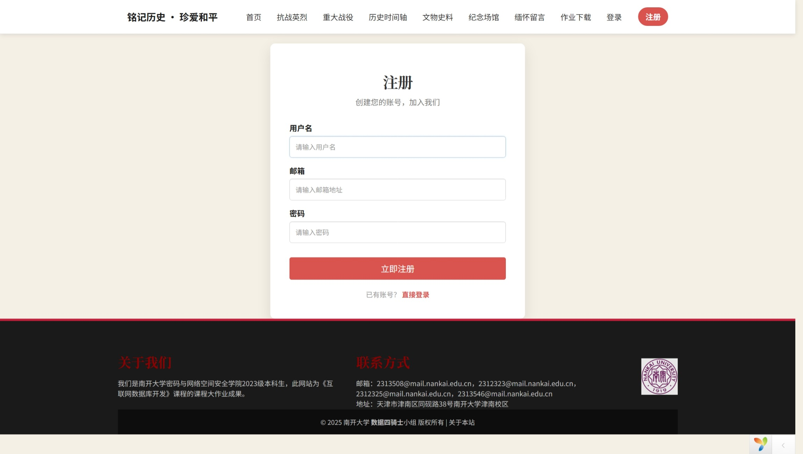

注册用于创建个人账号，以便使用需要身份的功能（如：发表缅怀留言、管理个人发布内容等）。

操作步骤：
1. 输入用户名、邮箱与密码。
2. 提交注册表单。
3. 注册成功后返回登录页，使用新账号登录即可。

使用提示：
- 用户名用于登录与留言展示（留言会显示为当前登录用户名）。
- 密码在数据库中以加密形式保存，系统不会保存明文密码。

### 2. 登录与退出

如果已有账号，可以直接跳转登录：

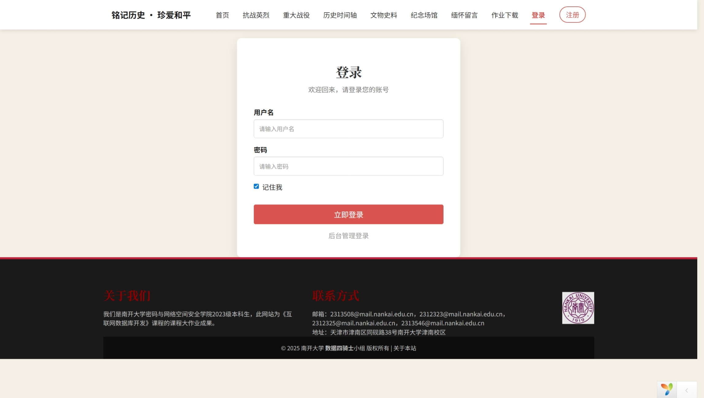

登录用于识别当前用户身份。登录后可使用“缅怀留言”发表/删除自己的留言，也可访问“作业下载”等需要登录才能更完整体验的功能入口。

操作步骤：
1. 输入用户名与密码。
2. 点击登录进入前台主页。
3. 需要退出时，点击导航栏中的“退出（用户名）”按钮即可安全退出。

常见问题：
- 若提示用户名或密码错误，请检查大小写与输入法全角/半角，或确认账号是否已注册成功。

### 3. 管理员登录入口

管理员可通过点击“后台管理”进入后台登录页（演示账号）：
参考账号：admin  
密码：password

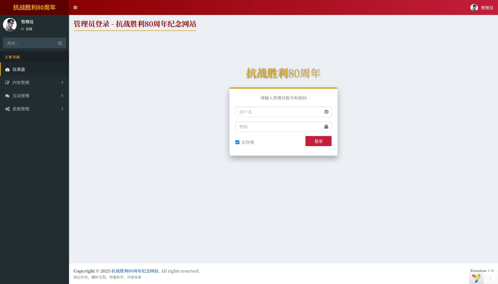

该入口仅供管理员使用。管理员登录后可维护前台展示内容（英烈、战役、文物、场馆等）、处理用户留言、管理用户权限。

安全提醒：
- 演示账号仅用于课程展示环境，真实部署时应修改默认密码并限制后台访问来源。

### 4. 首页（导航与信息总览）

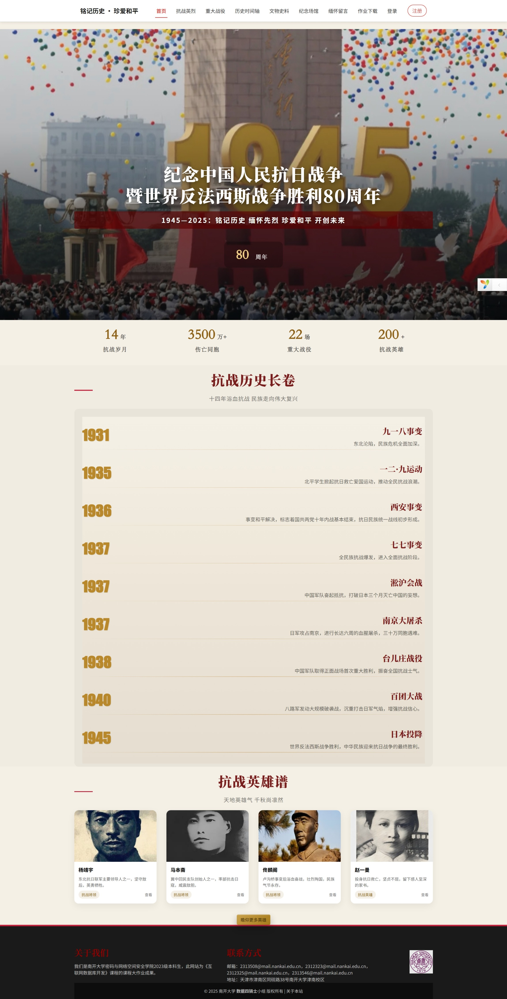

首页用于提供主题展示与快速入口，主要包含：
- 主题轮播与首页导语：展示网站主题与整体风格。
- 顶部导航栏：一键进入英烈、战役、时间轴、文物、场馆、留言、下载等模块。
- 页面内信息卡片/板块：用于呈现精选内容或最新动态（以实际页面展示为准）。

推荐使用方式：
1. 首次访问先通过首页导航快速浏览各模块。
2. 对感兴趣的条目点击“详情/查看”进入详情页阅读完整资料。

### 5. 抗战英烈（列表与生平详情）

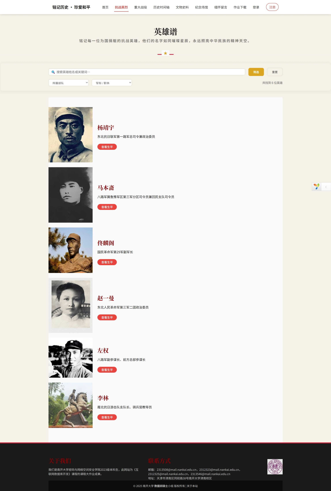

英烈模块用于集中展示英雄人物信息，便于公众浏览与学习。列表页一般包含英雄姓名、简要介绍与入口按钮。

典型操作：
1. 在英烈列表页浏览英雄卡片。
2. 点击“查看生平/详情”进入人物详情页，阅读更完整的生平、事迹与相关信息。

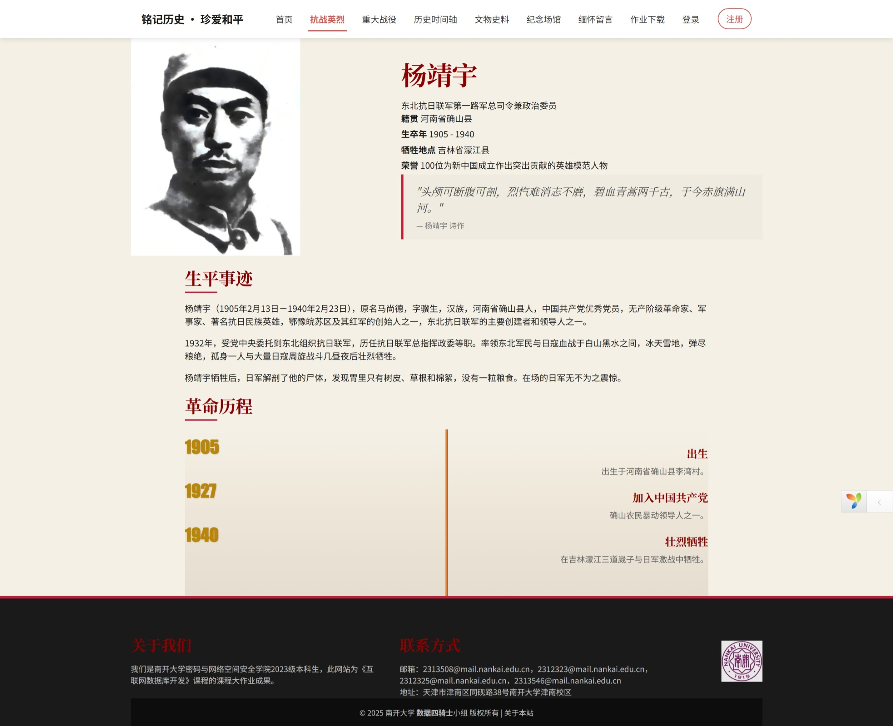

详情页信息（以实际数据为准）通常包含：
- 基本信息：出生/牺牲年份、籍贯、头衔/职务等。
- 事迹简介与生平：更长文本介绍英雄经历与历史背景。
- 图片：人物照片/大图等（如已在后台录入）。

### 6. 重大战役（列表视图与地图视图）

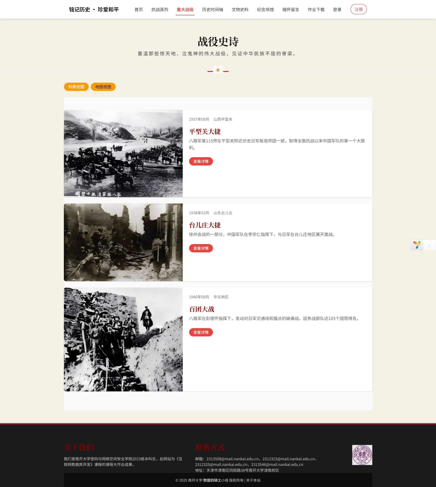

战役模块用于按时间线索呈现抗战期间的重要战役。列表视图帮助用户快速了解战役名称、发生时间、地点与概览说明，并提供进入详情页的入口。

建议操作流程：
1. 在列表中按时间顺序浏览战役。
2. 点击某条战役进入详情页查看更完整内容（背景、经过、结果与意义等）。

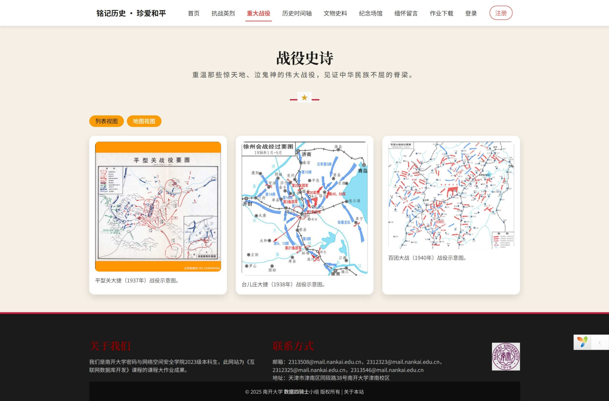

地图视图用于强化空间认知，将战役标注到地图上，便于理解战役在地理上的分布关系。

典型交互：
- 点击地图标记查看对应战役的简要信息与详情入口。
- 在地图上对比不同战役的分布，结合时间与地点理解历史进程。

### 7. 历史时间轴（按年份串联重大节点）

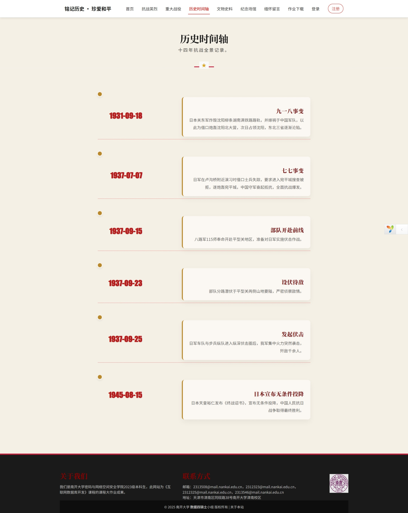

时间轴模块用于把分散的历史事件按日期串联展示，帮助用户“按时间阅读历史”。每个节点通常包含日期、标题与简述，部分节点可与英雄/战役等内容相互关联。

使用方式：
1. 通过上下滚动（或左右滑动，取决于页面样式）浏览不同年份事件。
2. 阅读节点摘要，理解该事件在整体历史中的位置。
3. 若节点包含详情入口，可进一步进入相关页面阅读扩展内容。

### 8. 文物史料（图文展示与分类信息）

文物史料模块用于展示珍贵的抗战相关史料与文物信息，强调“图文并茂”与“可持续扩展”。

你可以在该模块中看到（以实际数据为准）：
- 文物名称、类别、年代、现藏地点等结构化信息。
- 文物图片与说明文字，便于对照阅读与学习。

### 9. 纪念场馆（参观指南与外部链接）

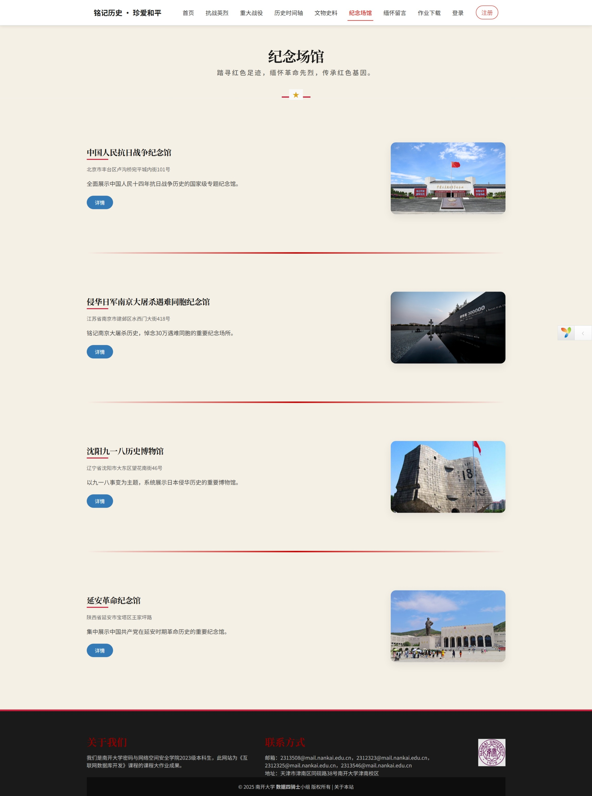

纪念场馆模块用于提供线下参观的指引信息。列表页展示场馆名称、地址与简要描述，并提供“详情”入口。

典型操作：
1. 在场馆列表页浏览各地场馆信息。
2. 点击“详情”进入场馆详情页，查看开放时间、交通建议、联系电话等参观指南。
3. 若场馆提供官方网站链接，可点击跳转到外部站点获取最新公告（如临时闭馆、预约规则等）。

### 10. 缅怀留言（发表、展示与自助删除）

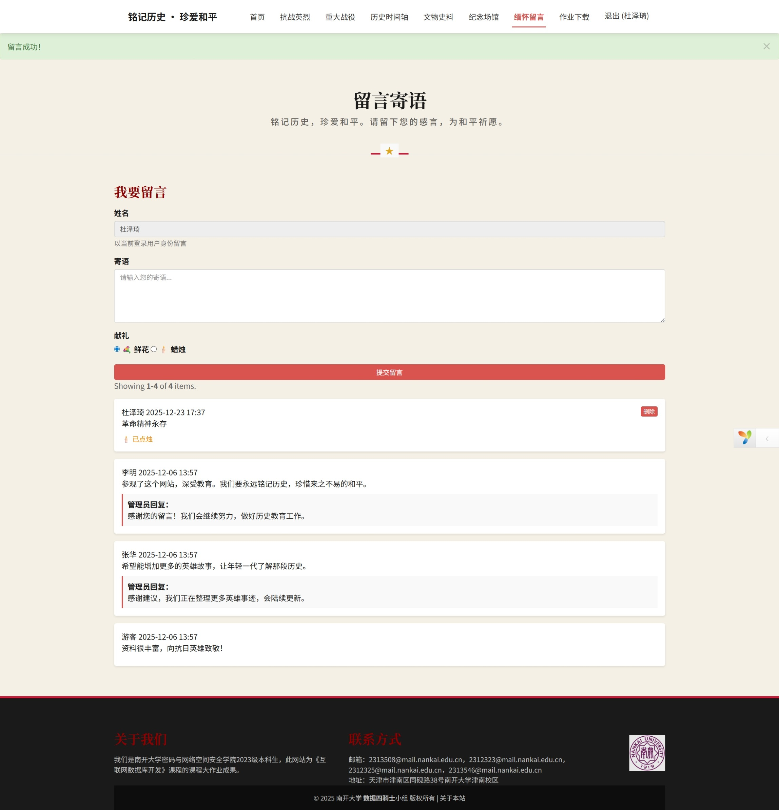

缅怀留言用于用户表达敬意与哀思，并与其他访客共同交流纪念感悟。

主要功能：
- 留言浏览：按时间倒序分页展示最新留言。
- 留言发布：需登录后才可发布留言，留言会记录发布者与时间。
- 留言删除：登录用户可删除自己发布的留言（用于自助纠错或撤回）。

使用提示：
- 未登录提交留言会提示先登录并跳转登录页。
- 部分留言支持选择“献礼/献花”等选项，系统会与文字内容一并保存与展示（以页面表单为准）。

### 11. 作业下载（文件列表与下载）

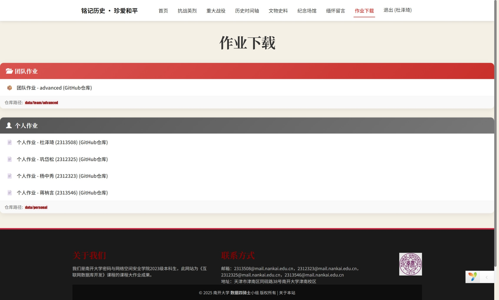

作业下载专区用于集中提供课程相关资料与作业文件下载，页面会按类别展示可下载的文件列表（如团队/个人目录），点击对应文件即可下载。

注意事项：
- 本身要把文件一起放到advanced里面实现下载，综合考虑为了节约内存和网络稳定，我们选择直接跳转仓库

### 12. 关于本站（项目说明与开发团队）

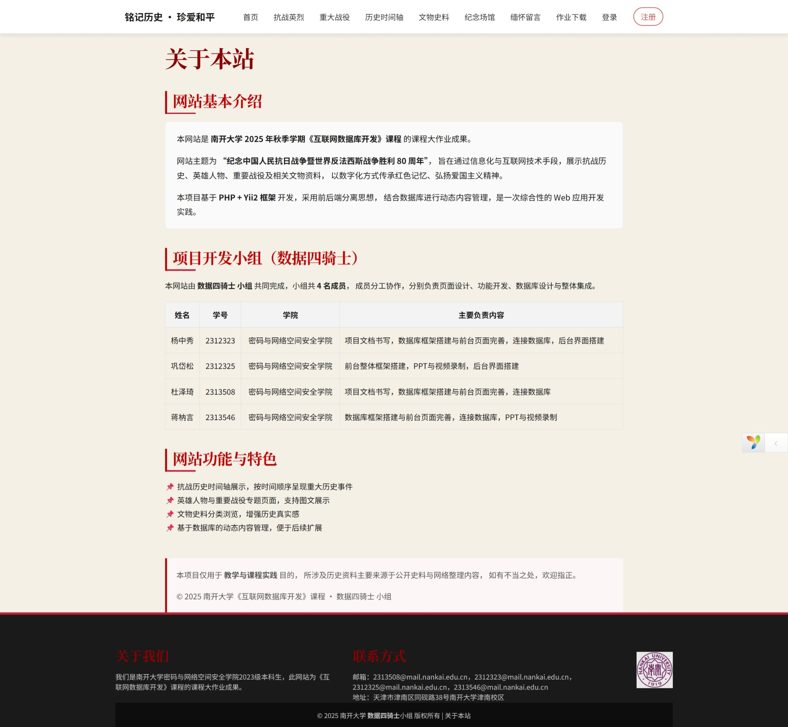

“关于本站”用于说明网站背景、课程属性与团队信息，包含项目简介、开发小组成员与功能特色等内容，便于展示项目来源与分工协作情况。

## 数据库

[war_memorial库](http://localhost:8080/phpmyadmin/index.php?route=/database/structure&db=war_memorial)

本系统使用 `war_memorial` 数据库保存业务数据。前台展示内容（英烈、战役、文物、场馆、时间轴等）与用户互动（留言、用户账号）均由数据库提供支撑，后台管理对这些表执行增删改查以实现内容更新。

### User 表（用户账号）

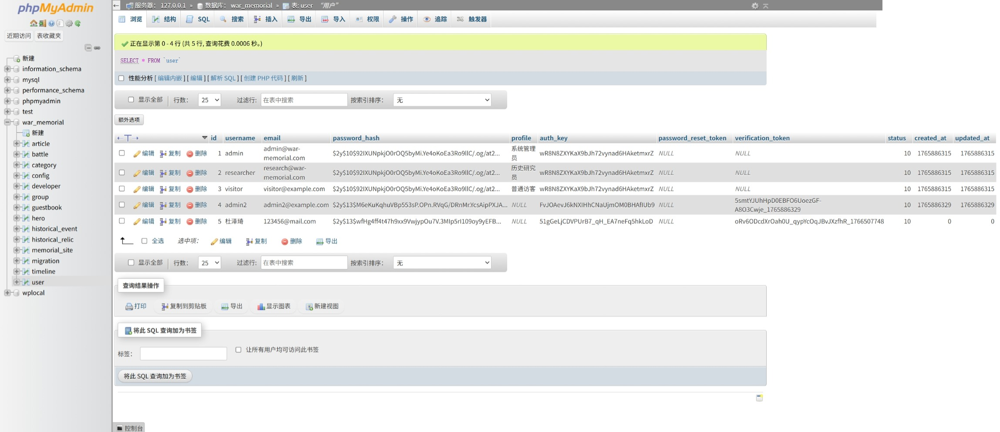

`user` 表是系统用户管理的基础数据，常用字段含义如下（以实际数据库为准）：
- `id`：用户主键。
- `username`：用户名（登录名、留言展示名）。
- `email`：邮箱（用于找回密码/通知等扩展能力）。
- `password_hash`：加密后的密码摘要（不保存明文密码）。
- `auth_key`：用于“记住登录状态”等身份校验。
- `status`：账号状态（如：启用/未激活/删除）。
- `password_reset_token`、`verification_token`：找回密码与邮箱验证相关的令牌字段。
- `profile`：用于存放用户角色/身份信息（课程演示中用于区分普通用户与系统管理员）。

## 后台

后台系统面向管理员，用于维护前台展示内容与用户互动数据。后台页面通常包含：侧边栏导航、列表（表格）视图、搜索筛选、表单编辑等典型管理界面元素。

### 1. 仪表盘（后台首页）

登陆后来到主界面仪表盘：

仪表盘用于汇总展示后台运行状态与关键数据入口，常见信息包括：
- 用户与内容的统计概览（数量、最近更新等）。
- 管理入口的快捷导航，便于管理员快速定位需要维护的模块。

### 2. 内容管理（英烈/战役/时间轴/文物/场馆/文章等）

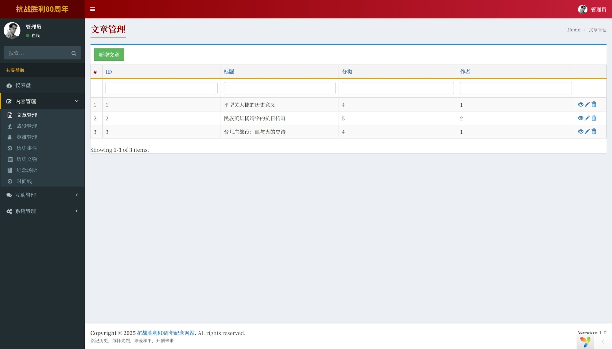

内容管理模块用于维护前台展示的核心数据。管理员可以对各类内容进行：
- 新增：录入新英雄、新战役、新文物、新场馆等资料。
- 编辑：修正文案、补充图片、更新开放时间等字段。
- 删除：下架错误或重复记录（谨慎操作）。
- 搜索与筛选：通过关键词、分类、时间等条件快速定位记录（以后台页面提供的筛选项为准）。

使用建议：
- 录入内容时尽量完整填写字段（标题、简介、详情、图片等），可显著提升前台展示效果。
- 图片/媒体资源建议使用清晰度适中且体积合理的文件，避免影响加载速度。

### 3. 留言板管理（审核与维护互动内容）

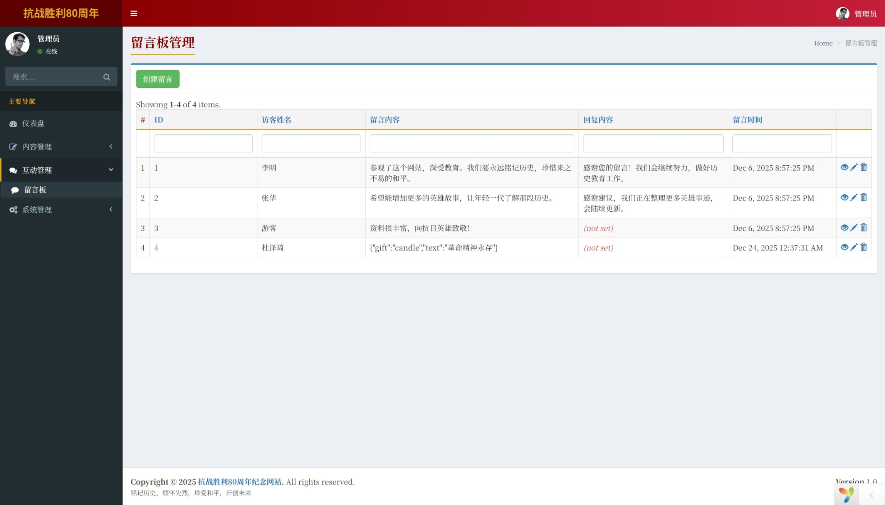

留言板管理用于维护前台用户留言数据，管理员可根据需要进行：
- 查看留言内容与发布时间，定位不当信息。
- 删除违规留言，维护良好互动氛围。
- 回复留言（如系统支持回复字段展示，可用于官方回应与引导）。

### 4. 系统管理-用户管理（账号与权限）

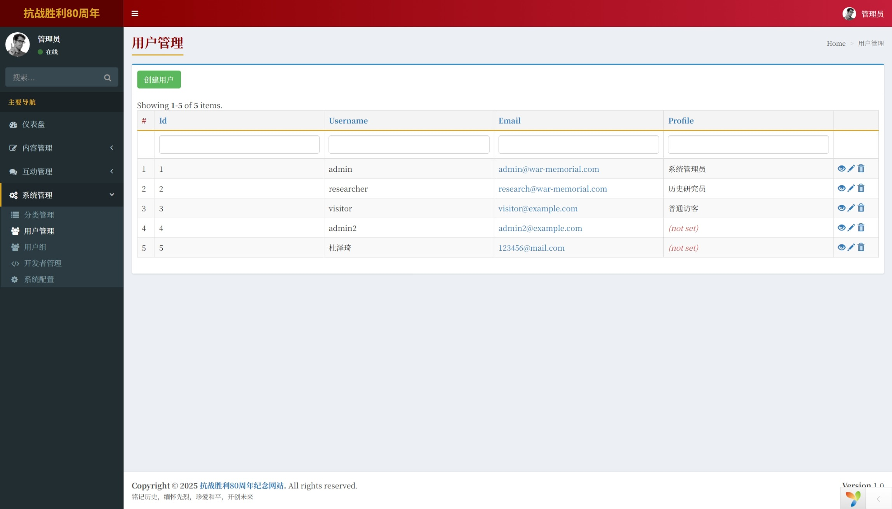

用户管理用于维护注册用户信息与权限配置。常见操作包括：
- 查看用户列表与基本信息。
- 修改用户状态（如封禁违规账号、恢复账号等）。
- 调整用户身份（普通用户/管理员）。

课程演示中：将 `Profile` 修改为“系统管理员”即可实现权限提升。

### 5. 系统管理-开发者管理（团队信息维护）

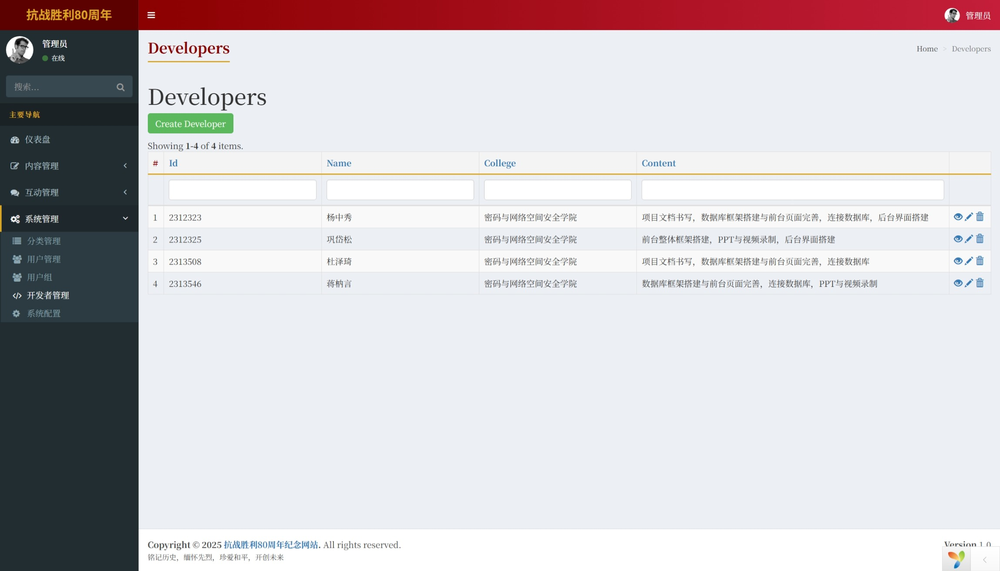

开发者管理用于维护“关于本站”页面展示的小组成员信息，包括姓名、学号、学院与分工内容，便于项目展示与后续维护更新。

小组成员管理入口位于该模块中，可进行新增、编辑与删除操作。
