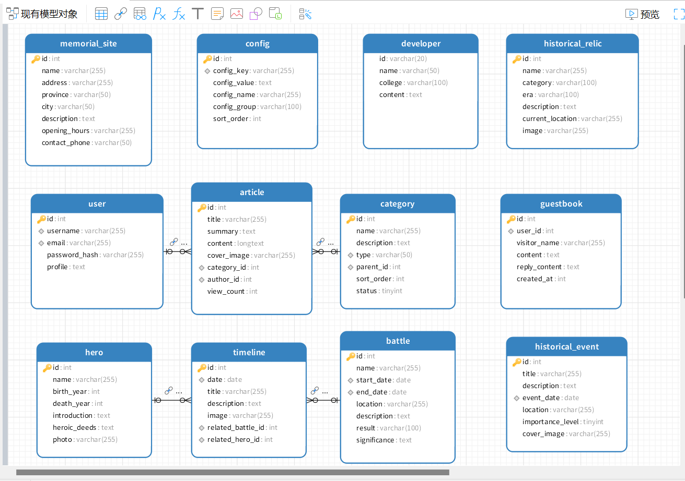
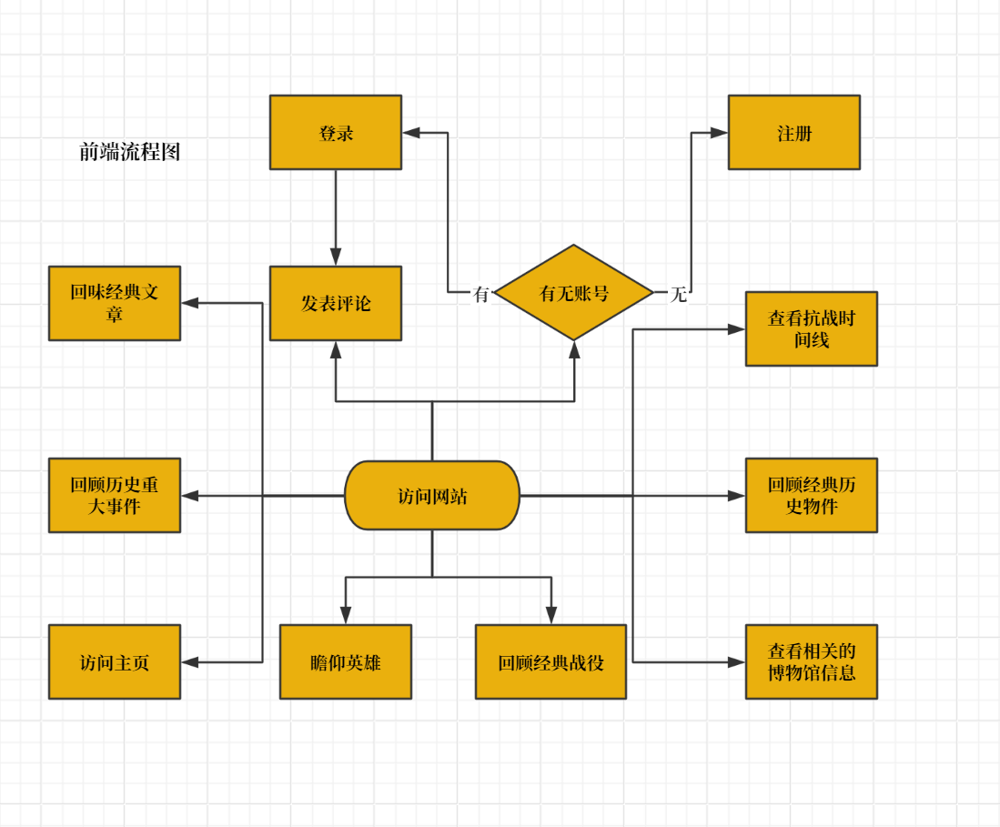
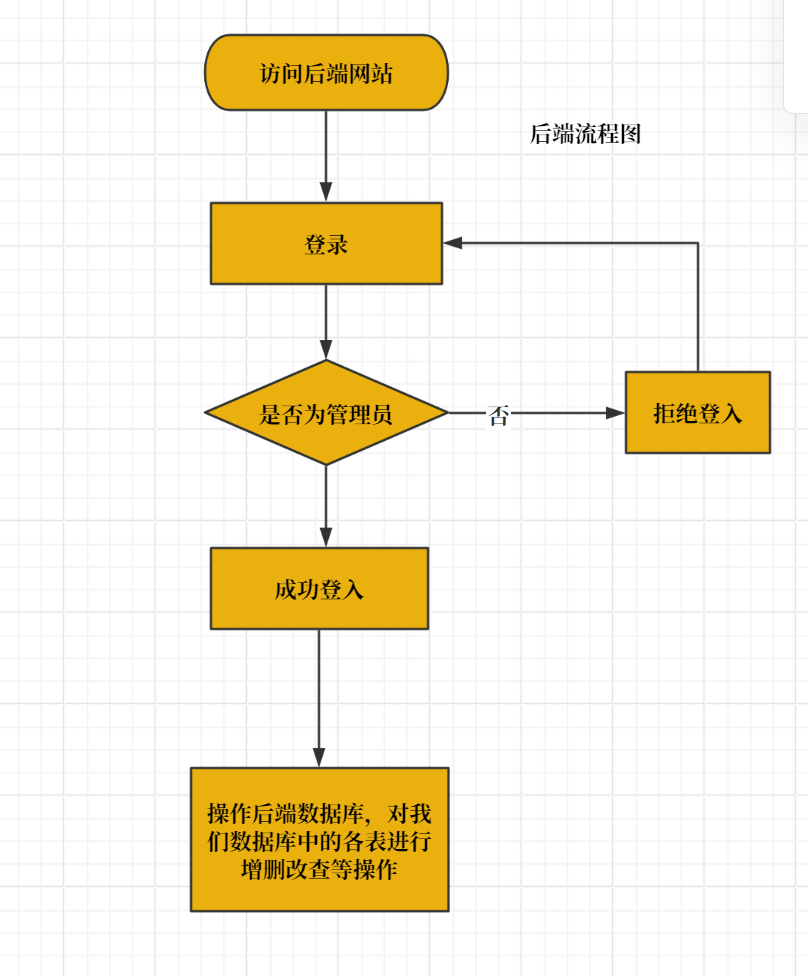

<h1 align='center'>互联网数据库开发项目文档

<h2 align='center'>设计文档

## 一、项目背景与课程目标	

​	本项目为《互联网数据库开发》课程的综合实践作业，为指定主题的**抗战胜利纪念主题网站**，旨在通过一个完整的互联网数据库应用，综合运用课堂所学的数据库建模、关系设计、Web 框架开发以及前后端协作思想，将“数据库”从抽象概念真正落地为一个可以被访问、被使用、被维护的系统。

​	项目并非只关注数据的存储本身，而是尝试在合理范围内模拟一个真实网站的运行方式，包括历史内容的展示、人物与事件的组织、用户访问与留言互动，以及后台对内容的集中管理，数据库在整个系统中并不是配角，而是核心支撑，所有页面、功能与逻辑最终都围绕数据库结构展开。

## 二、系统整体架构设计

### （一）技术选型

​	本项目基于 **Yii2 Advanced Framework** 构建，采用 PHP + MySQL技术栈。系统整体采用前后端分离的多应用结构：

+ **frontend**：面向普通用户的前台访问系统
+ **backend**：面向管理员的后台管理系统
+ **common**：前后端共享的模型与配置
+ **console**：数据库迁移与命令行工具

### （二）项目架构图

```apl
advanced/
├── frontend/
│   ├── controllers/       
│   ├── views/              
│   └── web/                
├── backend/
│   ├── controllers/
│   ├── views/
│   └── web/
├── common/
│   ├── models/             
│   └── config/
└── console/
```

## 三、数据库设计总体思路 

### （一）数据库定位

​	数据库名为 **`war_memorial`**，用于支撑抗战历史纪念网站的全部核心功能。它并不是为了展示“我会建多少张表”，而是围绕**历史内容如何被组织、被串联、被访问**这一问题来展开设计。因此，数据库结构重点解决以下几个问题：

+ 如何表示英雄、战役、历史事件这些核心历史实体

+ 如何通过时间线把分散的信息串联起来

+ 如何让文章、分类、用户留言等内容围绕历史主题展开

+ 如何在保证结构清晰的前提下，避免过度复杂的关系设计

### （二）数据库划分

#### 1.历史内容模块

+ 英雄（`hero`）

+ 战役（`battle`）

+ 历史事件（`historical_event`）

+ 文物史料（`historical_relic`）

+ 纪念场馆（`memorial_site`）

#### 2.内容组织模块

+ 文章（`article`）

+ 分类（`category`）

+ 时间线（`timeline`）

#### 3.用户与互动模块

- 用户（`user`）
- 留言（`guestbook`）

#### 4.**系统支撑模块**

- 系统配置（`config`）
- 数据库迁移（`migration`）

### (三)核心数据表设计说明

#### 1. 用户表（`user`）

​	用于存储系统中所有用户的基本信息，包括管理员与普通访客。

- **id**：主键，用户唯一标识
- **username**：用户名，系统内唯一
- **email**：用户邮箱，用于登录与联系
- **password_hash**：密码哈希值，用于身份验证
- **profile**：用户简介或角色说明
- **auth_key**：身份认证密钥
- **status**：用户状态（正常、禁用等）
- **created_at**：创建时间
- **updated_at**：更新时间

​	该表为系统权限控制与用户行为记录提供基础支撑。

#### 2. 文章表（`article`）

​	用于存储网站中的历史文章内容，是前端展示的重要组成部分。

- **id**：主键，文章唯一标识
- **title**：文章标题
- **summary**：文章摘要，用于列表页展示
- **content**：文章正文内容
- **cover_image**：文章封面图片路径
- **category_id**：外键，关联到 `category` 表
- **author_id**：外键，关联到 `user` 表
- **view_count**：文章浏览次数

​	文章表与分类表、用户表形成基本内容管理结构。

#### 3. 分类表（`category`）

​	用于对文章内容进行分类管理，支持多级分类结构。

- **id**：主键，分类唯一标识
- **name**：分类名称
- **description**：分类说明
- **type**：分类类型（如 article）
- **parent_id**：父级分类 id，用于构建层级结构
- **sort_order**：排序字段
- **status**：分类状态

​	分类表为文章内容的组织与展示提供结构支持。

#### 4. 英雄表（`hero`）

​	用于存储抗战英雄人物的详细信息。

- **id**：主键
- **name**：英雄姓名
- **alias**：英文别名或拼音标识
- **title**：职务或称号
- **birth_year**：出生年份
- **death_year**：牺牲或去世年份
- **birth_place**：出生地
- **death_place**：牺牲地
- **introduction**：人物简介
- **biography**：详细生平事迹
- **photo**：人物照片

​	该表是英雄专题页面和时间线的重要数据来源。

#### 5.战役表（`battle`）

​	用于记录抗战期间的重要战役信息。

- **id**：主键
- **name**：战役名称
- **start_date**：战役开始日期
- **end_date**：战役结束日期
- **location**：战役发生地点
- **description**：战役经过描述
- **result**：战役结果
- **significance**：历史意义说明

​	战役表为网站中的战役回顾与历史分析模块提供数据支持。

#### 6.时间线表（`timeline`）

​	用于按时间顺序展示抗战历史中的重要节点。

- **id**：主键
- **date**：事件发生日期
- **title**：事件标题
- **description**：事件描述
- **related_battle_id**：外键，可关联到 `battle` 表
- **related_hero_id**：外键，可关联到 `hero` 表

​	时间线表通过可选关联，将英雄、战役与历史事件串联成整体叙事结构。

#### 7.留言表（`guestbook`）

​	用于记录用户在网站中的留言信息。

- **id**：主键
- **user_id**：外键，可为空，关联到 `user` 表
- **visitor_name**：留言者姓名
- **content**：留言内容
- **reply_content**：管理员回复内容
- **created_at**：留言时间

​	该表实现了网站的基本互动功能。

#### 8. 历史事件表（`historical_event`）

​	用于记录抗战时期具有重要意义的历史事件，作为时间线与专题展示的重要补充。

- **id**：主键，事件唯一标识
- **title**：事件标题
- **description**：事件详细描述
- **event_date**：事件发生日期
- **location**：事件发生地点
- **importance_level**：事件重要程度，用于前端筛选或排序
- **cover_image**：事件封面图片

​	该表用于独立展示重大历史节点，同时也可作为时间线内容来源。

#### 9. 历史文物表（`historical_relic`）

​	用于存储抗战相关的历史文物与史料信息。

- **id**：主键
- **name**：文物名称
- **category**：文物类别（如文献、实物、遗址等）
- **era**：所属历史时期
- **description**：文物介绍说明
- **current_location**：现存地点
- **image**：文物图片路径

​	该表用于文物展示模块，增强网站的史料真实性与历史厚重感。

#### 10. 纪念场馆表（`memorial_site`）

​	用于记录全国范围内的抗战纪念馆及相关场所信息。

- **id**：主键
- **name**：纪念场馆名称
- **address**：详细地址
- **province**：所在省份
- **city**：所在城市
- **description**：场馆介绍
- **opening_hours**：开放时间
- **contact_phone**：联系电话

​	该表为纪念场馆专题页面提供数据支持，也便于后期扩展地图展示功能。

#### 11. 系统配置表（`config`）

​	用于存储网站运行过程中的全局配置项。

- **id**：主键
- **config_key**：配置键名
- **config_value**：配置值
- **config_name**：配置项说明
- **config_group**：配置分组
- **sort_order**：排序字段

​	该表避免将网站配置写死在代码中，提高系统灵活性与可维护性。

#### 12.开发人员表(`developer`)

​	用于存储我们的小组个人信息。

+ **id**：学号，升序排列
+ **name**:姓名
+ **college**:学院
+ **content**:分工内容

### （四）数据库ER图



## 四、前端页面与资源管理设计

​	前端页面全部放置于 `frontend/views` 目录下，并按照控制器名称进行分类，例如：

- `views/hero`：英雄列表与详情页
- `views/battle`：战役页面
- `views/article`：文章页面
- `views/site`：首页与通用页面

​	页面通过控制器渲染，控制器负责从数据库中读取数据并传递给视图，视图本身不直接操作数据库，只负责展示。

## 五、项目流程图

### （一）前端流程图



### （二）后端流程图



## 六、项目设计总结

​	我们的项目项目围绕“抗战历史纪念”这一主题，完成了一个基于真实数据库设计的互联网应用，实现了从数据建模到页面展示的完整流程。在设计过程中，重点并不在于堆叠功能，而是在于结构清晰、逻辑合理、易于说明与维护。数据库不只是“存数据的地方”，而是整个系统能够正常运转的核心。作为课程作业，我们的项目体现了互联网数据库开发的基本思想，作为一个实际系统，它也具备继续扩展和优化的空间。

