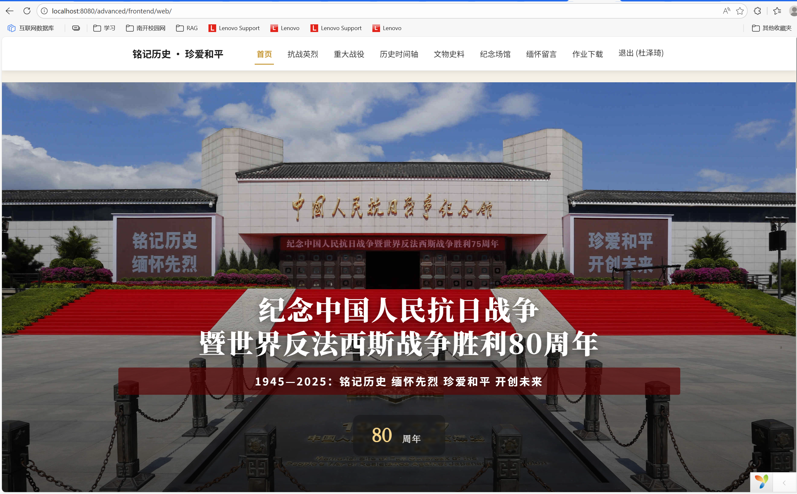
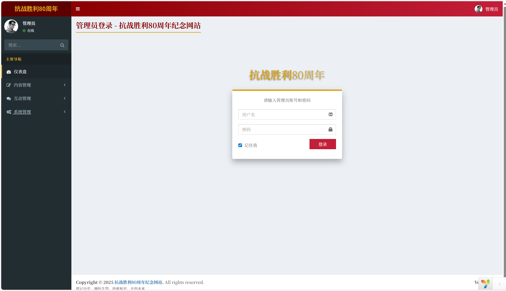

# <center>框架部署

### 首先安装XAMPP以及MySQL数据库（v3.3.0）

开启Apache与MySQL


尝试开启phpmyadmin失败，发现系统中已有MySQL80占用了3306端口，关闭服务即可（win+R,输入service.msc来关）

### Yii初始化

运行 "init.bat" 命令，选择开发环境(Development:开发环境; Production:生产环境);我们选择的开发环境

执行yii初始化命令 "./yii.bat";

修改数据库配置"\common\config\main-local.php";

创建相应的数据表，执行命令 "./yii.bat migrate";

注意添加系统环境路径

### 框架下载

[下载框架](https://github.com/du-zeqi666/2025_nankai_Internet-Database-Development/tree/main/advanced)

将文件放到`.\xampp\htdocs`

### 网页访问

**数据库**：http://localhost:8080/phpmyadmin/index.php

优先打开导入数据库sql文件"data/install.sql"数据库可命名为war_memorial

8080端口号可根据自身修改

**前台**：http://localhost:8080/advanced/frontend/web/



**后台**：http://localhost:8080/advanced/backend/web/index.php



`common\config\main-local.php`默认端口3306,可以根据本机端口号自行修改

```
'dsn' => 'mysql:host=127.0.0.1;port=3306;dbname=yii2advanced_test',
```

