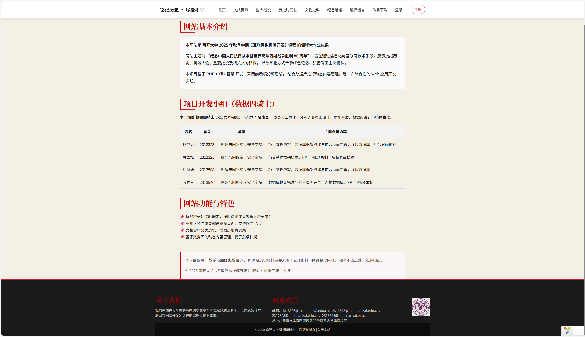
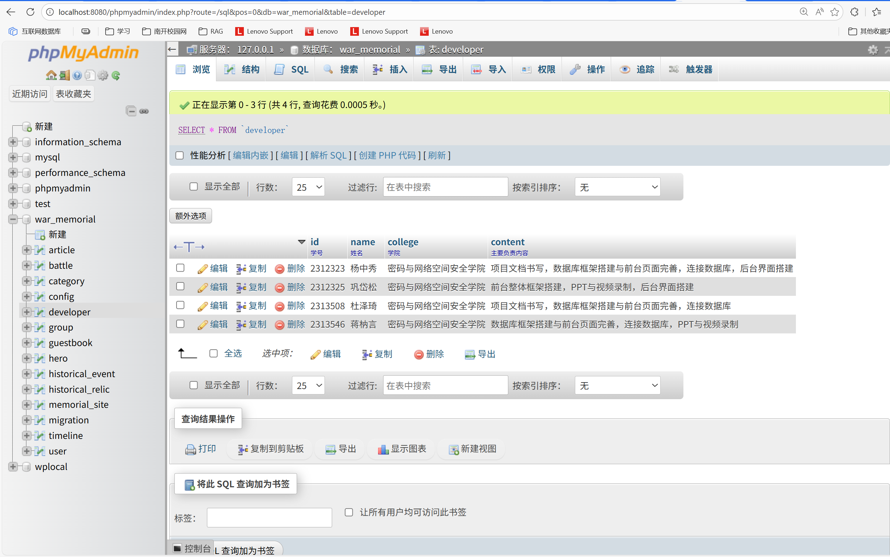
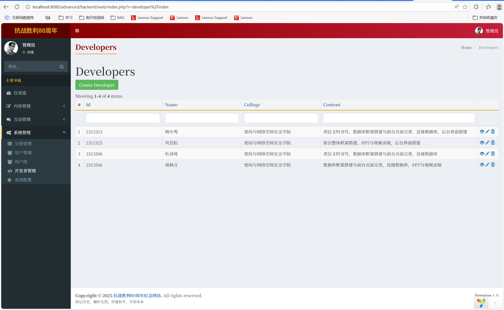
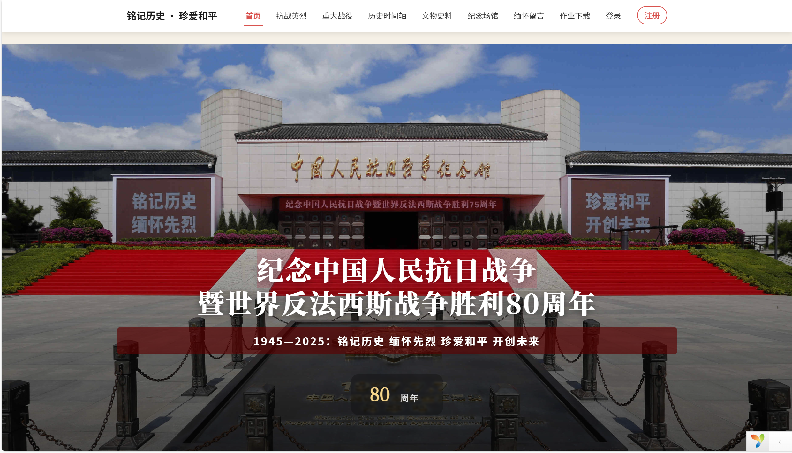

# 
军事主题——抗战胜利80周年

## 团队名：数据四骑士

**“关于本站”界面**

### 前台：团队及个人的展示、留言等

### 数据库：

### 后台：团队及个人信息的编辑、信息的发布等

### 数据库表数量>10及字段：

| 表名               | 字段                                                         |
| ------------------ | ------------------------------------------------------------ |
| `article`          | `id` `title` `summary` `content` `cover_image` `category_id` `author_id` `view_count` |
| `battle`           | `id` `name` `start_date` `end_date` `location` `description` `result` `significance` `image` `detail_image` `map_image` |
| `category`         | `id` `name` `description` `type` `parent_id` `sort_order` `status` |
| `config`           | `id` `config_key` `config_value` `config_name` `config_group` `sort_order` |
| `developer`        | `id` `name` `college` `content`                     |
| `group`            | `id` `name` `description` `created_at` `updated_at` |
| `guestbook`        | `id` `user_id` `visitor_name` `content` `reply_content` `created_at` |
| `hero`             | `id` `name` `alias` `title` `birth_year` `death_year` `birth_place` `death_place` `introduction` `biography` `heroic_deeds` `photo` `photo_large` `army` `rank` `honor` `quote` `quote_source` |
| `historical_event` | `id` `title` `description` `event_date` `location` `importance_level` `cover_image` |
| `historical_relic` | `id` `name` `category` `era` `description` `current_location` `image` |
| `memorial_site`    | `id` `name` `address` `province` `city` `description` `opening` `phone` `transport` `details` `website` `image` |
| `migration`        | `version` `apply_time`                                    |
| `timeline`         | `id` `date` `title` `description` `image` `related_battle_id` `related_hero_id` |
| `user`             | `id` `username` `email` `password_hash` `profile` `auth_key` `password_reset_token` `verification_token` `status` `created_at` `updated_at` |

### 主页动态图形展示：

[后台仪表盘](http://localhost:8080/advanced/backend/web/index.php)

随鼠标移动内容分布显示变化

[铭记历史 珍爱和平 - 抗战胜利80周年纪念网](http://localhost:8080/advanced/frontend/web/)

界面自动切换

### 团队合作工具：Github

仓库链接：[du-zeqi666/2025_nankai_Internet-Database-Development: 由我们小组共同完成的2025互联网数据库开发大作业](https://github.com/du-zeqi666/2025_nankai_Internet-Database-Development)

### 项目管理工具：飞书

飞书链接：https://nankai.feishu.cn/wiki/DDDYwmQFWiBP4jks6K5cl75UnCh?from=from_copylink